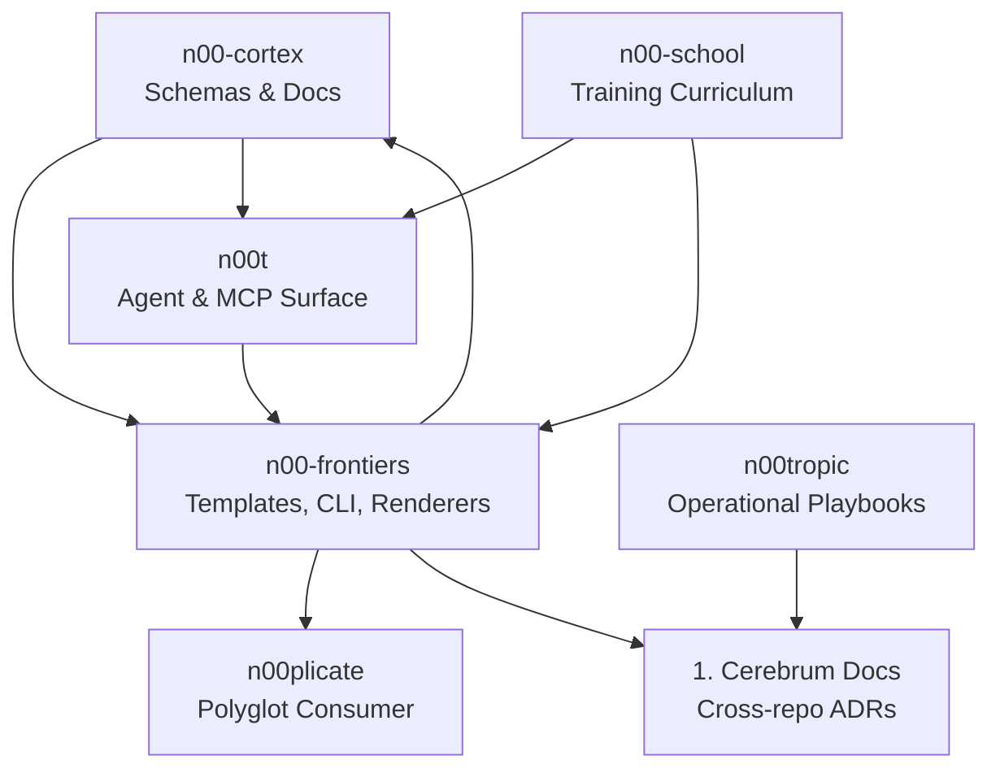
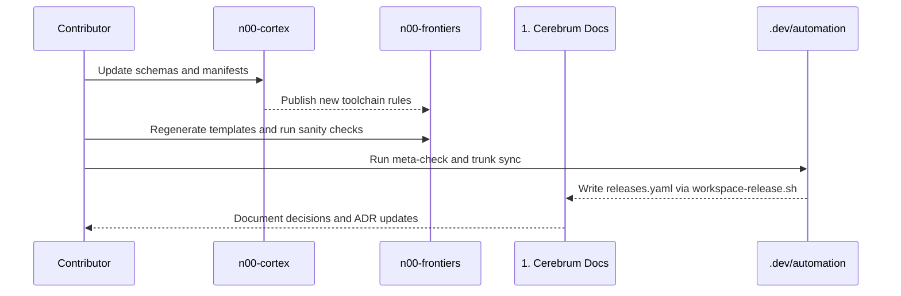

# n00tropic Cerebrum workspace

The Cerebrum workspace stitches together the repositories that power n00tropic's platform: changelog automation, documentation, agent workflows, training curricula, and template generators. Each repository keeps its own release cadence and tooling, while this workspace supplies shared automation and alignment.

## Ecosystem map



Schemas published from `n00-cortex` drive automation in `n00-frontiers`, which then feeds downstream consumers such as `n00plicate` and the shared documentation set. `n00t` orchestrates the automation surface, while doctrine (`n00tropic`) and training signals (`n00-school`) complete the feedback loop.

Source-of-truth policy:

- `n00-frontiers` is the canonical SSoT for standards, templates, and governance; everything else should align to it.
- `n00-cortex` enforces schemas/manifests derived from `n00-frontiers` so downstream automation stays pinned to the frontier rulebook.
- `n00menon` is the docs SSoT (TechDocs/Antora content) that narrates the standards and their changes.

> Looking for the people-facing handbook? It now lives alongside the filesystem in `../n00tropic_HQ/`.

## Repository profiles

### `1. Cerebrum Docs/`

- **Focus**: cross-repo decision records, release manifests, and workspace onboarding docs.
- **Key artifacts**: ADRs, `RENOVATE_SETUP.md`, `TRUNK_GUIDE.md`, `releases.yaml` (written by automation).
- **Role**: canonical reference material other repos reference for shared policy.

### `n00-frontiers/`

- **Mandate**: authoritative source for software, delivery, and design excellence. Defines the standards that every downstream system follows.
- **Output**: templates, notebooks, CLI tooling, and the quality bar for frontier-grade work.
- **Cadence**: updated frequently; every change should be reflected in `docs/`, `catalog.json`, and TASKS/ADR tracking.
- **SSoT**: canonical for standards/templates/governance; upstream for `n00-cortex`, `n00tropic`, `n00t`, and `n00plicate`.

### `n00-cortex/`

- **Mandate**: systematizes and enforces the rules issued by `n00-frontiers`. Publishes schemas, manifests, and documentation that downstream consumers must obey.
- **Output**: JSON Schemas, toolchain manifests, canonical documentation site, and reusable templates.
- **Dependency**: pulls rendered assets and policies from `n00-frontiers` before distributing them; treat schemas/manifests here as derived from the frontier SSoT, not the origin of policy.

### `n00tropic/`

- **Mandate**: organizational handbook and flagship generation engine. Houses briefs, discovery artifacts, and generators that translate context into scaffolded projects and assets.
- **Output**: context ingestion, directory/project scaffolding, and operational doctrine for every service pillar.
- **Integration**: feeds `n00t` with briefs and configuration; ensures generated artifacts comply with `n00-frontiers` and `n00-cortex`.

### `n00menon/`

- **Mandate**: documentation SSoT (TechDocs/Antora) for the workspace; narrates standards, ADRs, and changelogs for humans and agents.
- **Output**: docs site content, ADR rollups, TechDocs bundles consumed by Backstage.
- **Integration**: ingests standards from `n00-frontiers` and derived schemas from `n00-cortex`; referenced by automation and `n00t` for context.

### `n00t/`

- **Mandate**: agent and automation control center. Discovers capabilities, runs workspace scripts, and brokers context between humans, agents, and repos.
- **Output**: MCP host, capability manifest, orchestration UI/CLI.
- **Integration**: invokes automation scripts and propagates telemetry back to `n00-cortex` and `n00-frontiers`.

### `n00plicate/`

- **Mandate**: platform-agnostic design asset + CDN generator. Converts Penpot/token sources into multi-runtime packages.
- **Output**: token orchestrator, UI kernel, framework adapters, and reference apps.
- **Integration**: aligns with `n00-frontiers` design rules and feeds packaged assets to `n00tropic` deliverables.

### `n00-school/`

- **Mandate**: training center and R&D lab for n00tropic assistants. Develops and evaluates pipelines that improve automation quality.
- **Output**: training datasets, pipelines, evaluation harnesses, and telemetry.
- **Integration**: capabilities surface through `n00t`; insights loop back into `n00-frontiers` standards.

### `n00-horizons/`

- **Mandate**: project management, ideation, and strategy hub. Ensures every idea is traceable to deliverables and upstream/downstream impacts.
- **Output**: experiment briefs, GitHub issue/project orchestration, and strategic playbooks.
- **Integration**: operates under the `n00-frontiers` horizon workflow and reports impacts to affected repos.

### `n00clear-fusion/`

- **Mandate**: ingestion, enrichment, and RAG-friendly export pipelines that transform PDFs, Word docs, tabular data, and transcripts into n00t-ready training packs.
- **Output**: `corpora/` manifests, `pipelines/` processors, and `exports/` bundles that downstream repos (n00-horizons jobs, n00-frontiers templates, n00t capabilities) can consume without extra glue code.
- **Integration**: shares derived assets with `n00-cortex` taxonomies, feeds cookiecutters/templates in `n00-frontiers`, and backfills `n00t` capabilities so agents can scaffold projects from curated source material.

## AI/Agent Capabilities

The workspace implements production-grade AI agent patterns through the Microsoft Agent Framework adoption (see `n00-school/ADR/ADR-003-agent-framework-adoption.md`).

### Multi-Agent Patterns (`n00-horizons/horizons_executors.py`)

| Pattern        | Executor                     | Description                                                            |
| -------------- | ---------------------------- | ---------------------------------------------------------------------- |
| Reflection     | `ReflectionExecutor`         | Generate → Critique → Refine loop with configurable quality thresholds |
| Fan-Out/Fan-In | `FanOutExecutor`             | Parallel execution across multiple agents with aggregation strategies  |
| Sequential     | `SequentialWorkflowExecutor` | Step-by-step workflow with context passing between stages              |

### Enhanced RAG Pipeline (`n00clear-fusion/`)

| Component          | Module                | Features                                                             |
| ------------------ | --------------------- | -------------------------------------------------------------------- |
| Hybrid Search      | `fusion_rag.py`       | Dense (embedding) + sparse (BM25) search with reciprocal rank fusion |
| Reranking          | `fusion_rag.py`       | Cross-encoder reranking using MS-MARCO models                        |
| Citation Grounding | `fusion_rag.py`       | Sentence-level attribution to source documents                       |
| Multi-Agent RAG    | `fusion_workflows.py` | VerifyAndRefineWorkflow, ConsensusWorkflow patterns                  |

### Model Routing (`n00t/packages/agent-core/src/model_router.py`)

Cost-aware model selection with:

- Capability-based routing (reasoning, coding, chat, embedding)
- Tiered cost management (FREE → VERY_HIGH)
- Fallback chains for resilience
- Host detection (GitHub Models, Azure AI Foundry, OpenAI)

### Evaluation Framework (`n00-school/school_evaluation.py`)

RAG-specific evaluators:

- **Retrieval**: MRR, NDCG@k, Recall@k, Precision@k
- **Quality**: Faithfulness (grounding), Answer Correctness, Context Relevance
- **Integration**: RAGAS metrics with Azure AI Evaluation SDK fallbacks

### Observability (`n00clear-fusion/fusion_otel.py`)

OpenTelemetry instrumentation with semantic conventions:

- `GenAIAttributes` - LLM call tracing (model, tokens, temperature)
- `RAGAttributes` - Retrieval operation metrics
- `AgentAttributes` - Multi-agent workflow tracing

### MCP Federation (`n00t/packages/mcp-proxy/`)

Advanced tool federation for cross-agent collaboration:

| Component               | Module                   | Features                                      |
| ----------------------- | ------------------------ | --------------------------------------------- |
| Permission System       | `advanced_federation.py` | Capability-based ACL with rate limiting       |
| Tool Delegation         | `advanced_federation.py` | Cross-agent tool sharing with expiration      |
| Tool Composition        | `advanced_federation.py` | Multi-step tool chaining with context passing |
| Agent Message Bus       | `advanced_federation.py` | Async agent-to-agent communication            |
| Federated Agent Network | `advanced_federation.py` | Unified orchestration of all federation       |

## Cross-repo release flow



This sequence highlights the typical cadence: adjust policy in `n00-cortex`, adapt generators in `n00-frontiers`, validate via automation, and record the outcome in shared documentation.

## Automation toolkit

Node version pinning: scripts automatically load nvm (if installed) and `nvm use` the workspace `.nvmrc` via `scripts/ensure-nvm-node.sh`. If nvm is absent, scripts warn and continue using the current Node.

Automation scripts live under `.dev/automation/scripts/` and surface through the `n00t` capability manifest.

### Backstage & Sync

- Backstage actions required for frontiers templates: `fetch:template`, `publish:github`, `catalog:register` (configure GitHub token for publish/register).
- Scaffolder descriptors live in `n00-frontiers/.backstage/scaffolder-templates/`; regenerate with `python3 tools/generate_scaffolder_descriptors.py`.
- Ecosystem sync: `pnpm run sync:ecosystem` (wraps `scripts/sync-ecosystem.sh`), telemetry at `.dev/automation/artifacts/automation/sync-ecosystem-<ts>.json`.

### ControlTower CLI (Swift)

- Location: `Package.swift` / `Sources/ControlTower/`.
- Docs: `CONTROL_TOWER.md`.
- Run: `swift run control-tower help`.
- Commands: `status`, `validate-cortex`, `graph-live`, `graph-stub`.

| Script                                 | Purpose                                                                                                                                                                                    |
| -------------------------------------- | ------------------------------------------------------------------------------------------------------------------------------------------------------------------------------------------ |
| `meta-check.sh`                        | Orchestrates repo health checks, schema validation, and CVE scans before publishing changes.                                                                                               |
| `refresh-workspace.sh`                 | Fast-forwards each repo and updates submodules to keep local clones aligned.                                                                                                               |
| `trunk-upgrade.sh`                     | Runs `trunk upgrade` across repos (supports repo filters and extra flags when invoked via capabilities).                                                                                   |
| `check-cross-repo-consistency.py`      | Ensures toolchain manifests and overrides remain aligned.                                                                                                                                  |
| `workspace-release.sh`                 | Verifies clean git state and writes `1. Cerebrum Docs/releases.yaml`.                                                                                                                      |
| `ai-workflows/*`                       | Phase-specific scripts for the AI-assisted development workflow surfaced by `n00t`.                                                                                                        |
| `project-preflight.sh`                 | Chains capture + GitHub/ERPNext syncs and fails fast when review cadence, links, or IDs are missing.                                                                                       |
| `project-lifecycle-radar.sh`           | Emits a JSON radar summarizing lifecycle totals, overdue reviews, and integration gaps for planning.                                                                                       |
| `project-control-panel.py`             | Builds `n00-horizons/docs/control-panel.md` so planning decks link runbooks, radar output, and preflights.                                                                                 |
| `scripts/erpnext-run.sh`               | Run-and-gun ERPNext dev stack: bootstraps bench, verifies MySQL/Redis, launches browser, logs telemetry, and triggers PM/telemetry exports.                                                |
| `project-preflight-batch.sh`           | Executes preflight across every registry entry to keep GitHub + ERPNext sync warnings visible.                                                                                             |
| `workspace-health.py`                  | Summarizes root + submodule git status, emits `artifacts/workspace-health.json`, cleans safe untracked files, and syncs submodules on demand.                                              |
| `workspace-health.py --auto-remediate` | Proactively applies skeleton fixes, syncs submodules, safe-cleans, and ensures default branches (opt-in).                                                                                  |
| `lint-workspace-manifest.py`           | Lints `automation/workspace.manifest.json` for required fields/uniqueness so new repos/roles/paths stay compliant.                                                                         |
| `manifest-gate.sh`                     | Blocks CI when gitmodules/on-disk repos are missing from the manifest.                                                                                                                     |
| `fusion-pipeline.sh`                   | One-click PDF ingest → embed (auto backend) → generate → graph rebuild; moves processed PDFs to `n00clear-fusion/corpora/Processed/`, logs run envelopes, registers horizons/school stubs. |
| `guard-root-pnpm-install.mjs`          | Blocks accidental `pnpm install` at workspace root; set `ALLOW_ROOT_PNPM_INSTALL=1` only when you truly need a root install.                                                               |
| `refresh-python-lock.sh`               | Regenerates or checks the Python lockfiles (`requirements.workspace.min.lock`, `requirements.workspace.lock`) using `uv`; CI can run the check to enforce reproducible deps.               |
| `check-runners.mjs`                    | Lists GitHub self-hosted runners for the superrepo + submodules (uses `GH_TOKEN`); nightly workflow alerts if coverage drops to zero.                                                      |
| `check-workspace-skeleton.py`          | Validates repos against the skeleton manifest and can scaffold missing directories/stubs; exposed to agents as `workspace.checkSkeleton`.                                                  |
| `normalize-workspace-pnpm.sh`          | Canonical entry for re-installing JS deps in templates/examples; now fails if Node pins drift (override with `--allow-mismatch`). Call `workspace.normalizePnpm` for MCP access.           |
| `venv-health.sh`                       | Audits `.venv-*` directories, optionally prunes invalid names, and refreshes envs from requirements files. Available to agents via `workspace.venvHealth`.                                 |
| `guard-subrepo-pnpm-install.mjs`       | Wired as `preinstall` in JS subrepos; blocks installs from the wrong directory/workspace context.                                                                                          |
| `cli.py health-*`                      | Front door commands wrapping health checks: toolchain, runners, Python lock, and JS normalization with consistent logging.                                                                 |

Agents can invoke these workflows via MCP using `workspace.checkSkeleton`, `workspace.normalizePnpm`, `workspace.venvHealth`, and `workspace.trunkUpgradeWorkspace` without touching bespoke scripts.

### Alerts (Discord)

- Set secret `DISCORD_WEBHOOK` to receive embeds for:
  - `runners-nightly` (zero self-hosted runners or check errors)
  - `python-lock-check` (lock drift on PRs or scheduled run)
  - Runner checks honor `REQUIRED_RUNNER_LABELS` (default `self-hosted,linux,x64,pnpm,uv`).

### Trunk

- `.trunk/` is tracked with linters/actions disabled to avoid hook overhead. Run `trunk check` manually if desired; hooks remain off by default.

### Environment files

- Populate secrets in the workspace root `.env` (ignored) using `.env.example` as a template; run `scripts/sync-env-templates.sh` to copy the template to each subrepo as `.env.example` (and stub `.env`).
- Common keys: `GH_TOKEN`, `GITHUB_TOKEN`, `DISCORD_WEBHOOK`, `REQUIRED_RUNNER_LABELS`.

## Quick start (fusion UI + graph)

- Serve graph for agents: `pnpm -C n00-cortex graph:serve` (port 7090).
- One-click fusion UI: `pnpm run ui:serve` then open `http://localhost:7800` to upload a PDF (backend selectable: auto/OpenAI/LM Studio compatible/hashed). Pipelines rebuild the graph and place original PDFs into `corpora/Processed/`.
- CLI pipeline: `./.dev/automation/scripts/fusion-pipeline.sh <pdf-or-dir> [dataset-id]`.

CI guardrail: `.github/workflows/fusion-pipeline-ci.yml` runs a tiny sample PDF through the pipeline and validates the catalog graph.\*\*\*
| `meta-check.sh` | Runs cortex schema validation and records a run envelope for telemetry (`.dev/automation/artifacts/automation/run-envelopes.jsonl`). |

Run `python cli.py --help` from the workspace root (or `n00-horizons/cli.py`, `n00-frontiers/cli.py`, etc.) to access curated wrappers around these scripts for both agents and humans.

Automation executions append telemetry to `.dev/automation/artifacts/automation/agent-runs.json`, which powers dashboards and agent insights.

## Subrepo contract and boundaries

- **Canonical remotes**: Every subrepo listed in `.gitmodules` maps to `https://github.com/n00tropic/<name>.git`. During cloning, run `git submodule update --init --recursive` (or `python cli.py workspace-health --sync-submodules`) so local remotes match the organization defaults.
- **Standalone readiness**: Each subrepo must boot with `pnpm install`, `pip install -r requirements.txt`, or its documented workflow without relying on files from other repos. Cross-repo assets move through published schemas (`n00-cortex`), catalogs (`n00-frontiers`), and generated bundles (`n00plicate`), never via direct relative imports.
- **Branch invariants**: `main` (or `doc` where noted) in every subrepo stays releasable. Feature branches may live either inside the subrepo or the superrepo, but merges always occur within the subrepo first so submodule pointers simply fast-forward.
- **Change propagation**: Update order stays Cortex -> Frontiers -> Consumers. When schema or template changes occur, tag the owning subrepo, then bump the submodule pointer in `n00tropic-cerebrum` via a workspace commit. Avoid editing generated assets under `n00-cortex/data/exports/**`, `n00-frontiers/applications/scaffolder/**`, or `n00tropic/06-Shared-Tools/Generated/`; rerun the documented generators instead.
- **Automation interface**: `n00t` surfaces capabilities from `.dev/automation/scripts/*`. When adding new automation, update `n00t/capabilities/manifest.json` and ensure logs land in `.dev/automation/artifacts/automation/` so subrepos can operate independently yet expose common tooling through the superrepo.

### Boundary enforcement checklist

1. Run `.dev/automation/scripts/workspace-health.sh --sync-submodules --json` (or `python cli.py workspace-health --sync-submodules`) to pin every submodule to its remote default and record git state in `artifacts/workspace-health.json`.
1. Execute `pnpm run trunk:check-all` so each repo proves formatter, lint, and unit-test parity before touching shared assets.
1. Inspect `git diff --submodule=log` to confirm only the intended submodules advanced and that the root repo contains the pointer bumps plus any automation/log artifacts.
1. Capture design or schema decisions in `1. Cerebrum Docs/ADR/` and link to the owning repo's ADR or TASK entry before merging cross-repo changes.
1. Release in the Cortex -> Frontiers -> Consumer order. Tag each repo before moving the next pointer so downstream repos consume only immutable versions.

### Workspace bootstrap & sanity

```bash
# One-shot bootstrap (submodules, pnpm, Python, Antora)
scripts/bootstrap-workspace.sh

# Repeat as needed:
scripts/check-superrepo.sh               # verify subrepos exist
pnpm install                             # install/update JS deps after lockfile changes
scripts/bootstrap-python.sh              # refresh shared Python deps (auto-installs uv; default = minimal)
source .venv-workspace/bin/activate      # activate venv in each shell before running automation
```

`scripts/check-superrepo.sh` aborts if any subrepo is missing (guiding you to `git submodule update --init --recursive`), while `scripts/bootstrap-python.sh` provisions `.venv-workspace` from the chosen requirements set so automation (MCP servers, project-control-panel, planners) never hit `ModuleNotFoundError`.

Python env modes:

- Default (minimal): `scripts/bootstrap-python.sh` installs `requirements.workspace.min.lock` (n00tropic + n00-school + mcp docs + pip-audit) for fast agent/automation setup.
- Full: add `--full` (or set `WORKSPACE_REQUIREMENTS_FILE=requirements.workspace.txt`) to pull in the `n00-frontiers` Jupyter/tooling stack. Use this when running notebook builds or frontiers tests locally.

`scripts/bootstrap-python.sh` installs [uv](https://github.com/astral-sh/uv) automatically (via curl/wget), uses a shared cache at `.cache/uv`, and syncs from the matching lockfile; it falls back to `pip` only if uv installation fails.

Caching for runners/agents: use `scripts/python-cache-key.sh [--full]` to emit a cache key derived from the lockfile hash. Point your cache to `.cache/uv` to reuse downloads across subrepos; set `UV_CACHE_DIR` to override.

> **Authentication tip:** when running inside Codex Cloud or other ephemeral runners, export `GH_SUBMODULE_TOKEN=<PAT with repo scope>` (or rely on `GITHUB_TOKEN`) before invoking `scripts/bootstrap-workspace.sh` so `git submodule update --init --recursive` can clone the private repos referenced in `.gitmodules`.

### Interaction matrix

| Repo               | Owns                                     | Consumes                                      | Gate                                                 |
| ------------------ | ---------------------------------------- | --------------------------------------------- | ---------------------------------------------------- |
| `n00-cortex`       | Schemas, manifests, shared docs          | `n00-frontiers` governance rules              | Tag + `pnpm run validate:schemas` before export      |
| `n00-frontiers`    | Templates, CLI, quality guardrails       | `n00-cortex` schemas                          | `nox -s validate_templates_all` + docs diff          |
| `n00t`             | MCP surface, capability manifest         | `.dev/automation/scripts/*` outputs           | Update `n00t/capabilities/manifest.json` + emit logs |
| `n00tropic`        | Generators, briefs, operational doctrine | `n00-frontiers` rules, `n00-cortex` manifests | Regenerate via `n00tropic_cli` and archive outputs   |
| `n00plicate`       | Token and UI bundles                     | `n00-frontiers` design tokens                 | `pnpm exec antora` + bundle snapshot                 |
| `1. Cerebrum Docs` | ADRs, release notes                      | Automation artifacts                          | `workspace-release.sh` runs cleanly                  |

Any repo that needs an asset from a sibling must reference the published artifact (schema tag, template export, Antora site) rather than reading files across directories.

## Formatter guardrails

- **Python format flow**: Every Trunk config runs `isort@7.0.0` before `black@25.x` so imports settle before layout styling. If a formatter loop appears, run `trunk fmt --filter=isort,black` or `isort . && black .` in the affected repo.
- **isort configuration**: `n00-frontiers/.isort.cfg` pins `profile = black` and `line_length = 120`, and the setting is mirrored by the other repos via Trunk sync so Black never rewrites imports immediately after isort.
- **Deep dive**: See `n00-school/docs/modules/ROOT/pages/learning-log/black-vs-isort.adoc` plus `n00-frontiers/docs/quality/formatting-style.md` for the rationale, escalation steps, and verification checklist agents should follow when formatters disagree.
- **Automation reminder**: `trunk-upgrade.sh` (and the `python3 cli.py trunk-upgrade` helper) keep formatter versions in lockstep across every repo, so rerun it whenever `isort`/`black` ship compatibility fixes.
- **Python linting helper**: run `pnpm run lint:python` in the workspace root to run `isort`, `black` and `ruff` checks across Python subprojects. The workspace CI now runs `pnpm run lint:python` as part of `workspace-health` to validate Python formatting and lint checks in PRs.

## Trunk control vs. subrepo autonomy

The workspace no longer vendors a root-level `.trunk/` directory. Canonical
definitions now live under `n00-cortex/data/trunk/base/.trunk/` (plus each
subrepo's own `.trunk/`). Copy or sync those configs before running Trunk (for
example via `scripts/sync-trunk-defs.mjs`) and install the CLI outside this
repo, exposing it through `TRUNK_BIN` or `PATH`.

To validate all subrepos centrally while preserving subrepo autonomy, the workspace CI runs the root helper script (`pnpm run trunk:check-all`) that executes `trunk check` in each subrepo. Each subrepo's `.trunk/trunk.yaml` still governs behavior for developer workflows and PR-bottom checks. This avoids conflicts and ensures CI-level uniformity.

- Root CI behavior: `pnpm run trunk:check-all` iterates over repo folders and runs `trunk check` in each, capturing JSON artifacts in `artifacts/trunk-results/`.
- Subrepo behavior: Each subrepo provides its own `.trunk/trunk.yaml`. If a subrepo lacks a `.trunk` directory, the workspace runner still runs `trunk check` with default settings and fail/record findings.

Tip: If you see 'unsupported linter' errors locally for `trunk` checks, run `pnpm run trunk:sync-defs` to copy the workspace standard definitions into each subrepo's `.trunk/trunk.yaml` (only when the subrepo needs the definitions locally). This avoids having to hand-edit each repo and remains reversible.

CLI installs are opt-in for developers: by default the automation scripts skip downloading the Trunk binary when it is missing. Run `trunk upgrade --no-progress` (or `TRUNK_INSTALL=1 .dev/automation/scripts/trunk-upgrade.sh`) when you explicitly want a local install; CI/ephemeral runners should set `TRUNK_INSTALL=1` so they can bootstrap without touching your home cache.

## Dependency placement and storage guidance

- Keep shared developer tooling at the workspace root (`pnpm install` at the root) to avoid installing the same tool multiple times in each subrepo. For example, `@biomejs/biome` is a workspace-level dev-dependency. Use `pnpm -w exec biome` to run the workspace-installed Biome from a subrepo.
- Single-subrepo utilities (for example, Antora for documentation) belong inside the repo that needs them, or they can run centrally from the workspace Antora binary so CI/workflows invoke `pnpm -w exec antora`. The root package.json already lists `@antora/cli` and `@antora/site-generator`, which keeps that binary consistent.
- Avoid running `pnpm install` inside each `trunk` lint definition; instead run `pnpm install` once at the job start or on the developer machine at root. Trunk definitions should invoke `pnpm -w exec` (workspace) or `pnpm -C <repo> exec` to run a binary from a specific subrepo to conserve local storage.

Local commands:

```bash
# Run trunk checks across each subrepo (same script CI uses):
pnpm run trunk:check-all

# Run the workspace-level Python checks (isort, black, ruff) locally:
pnpm run lint:python
```

## Operating guidelines

- **Plan in public**: Capture cross-repo decisions in `1. Cerebrum Docs/ADR/` and link to repo-specific ADRs.
- **Keep repos pristine**: Use `.dev/` directories for scratch assets and avoid committing generated artifacts.
- **Run the workspace maintenance loop**: Follow `1. Cerebrum Docs/WORKSPACE_MAINTENANCE.md` (plus the `AI_WORKSPACE_PLAYBOOK.md` companion) to run `workspace-health`, `meta-check`, and project preflights before every PR or release.
- **Version discipline**: Update `n00-cortex/data/toolchain-manifest.json` first when bumping runtimes so Renovate presets and generators stay aligned, then run `.dev/automation/scripts/sync-nvmrc.sh` to relink every subrepo’s `.nvmrc` back to the workspace source. `n00tropic/` and `n00plicate/` are allowed to lead (break the symlink) when coordinating early Node upgrades; everything else should inherit the workspace pin by default.
- **Release sequencing**: Tag repos independently, then run `workspace-release.sh` to snapshot versions and update documentation.
- **Security hygiene**: Run `pip-audit -r n00-frontiers/requirements.txt` (or rely on `meta-check`) before shipping templates.
- **Automation discovery**: Use `n00t/capabilities/manifest.json` to discover scripted operations for CLI or MCP clients.

## Workspace filesystem

Operational outputs live in the shared filesystem at `/Volumes/APFS Space/n00tropic`, organized as:

- `01-Leadership/`: governance, legal, and risk artifacts with links back to `n00tropic/01-Leadership`.
- `02-Revenue/`: campaign results, CRM exports, and sales intelligence synced from ERPNext.
- `03-Delivery/`: project deliverables, QA evidence, and support transcripts tied to ERPNext projects.
- `04-People/`: HRMS snapshots, onboarding packs, and n00-school evaluation summaries.
- `05-Finance-Procurement/`: accounting closes, purchasing approvals, and vendor records.
- `06-Innovation-Labs/`: R&D experiment outputs spanning `n00-frontiers`, `n00-cortex`, and `n00plicate`.
- `07-Platform-Ops/`: automation runbooks, telemetry, and ERPNext self-hosting playbooks.
- `99-Clients/`: per-client deliverables using the `@slug` naming convention.
- `90-Archive/`: immutable exports with checksums for audits.
- `98-Scratchpad/`: temporary drafts purged automatically after 30 days.

## Getting started locally

1. Clone the workspace: `git clone git@github.com:n00tropic/n00tropic-cerebrum.git && cd n00tropic-cerebrum`.
1. Initialize submodules: `git submodule update --init --recursive`.
1. Run `.dev/automation/scripts/workspace-health.sh --sync-submodules --publish-artifact --json` (optionally `--clean-untracked`) to align submodules and snapshot git state for agents and CI.
1. Install toolchains per repo (Python venv for `n00-frontiers`, Node for `n00-cortex` and `n00t`, pnpm for `n00plicate`). Run `nvm use` (or `nvm install`) against the workspace `.nvmrc` so your local Node matches CI—every workflow now calls `actions/setup-node` with `node-version-file: .nvmrc`, so bumping that file (and `n00-cortex/data/toolchain-manifest.json`) is all that’s required to propagate a new Node release.
1. Open the multi-root VS Code workspace (`n00-cortex/generators/n00tropic-cerebrum.code-workspace`).
1. Run baseline checks: `./.dev/automation/scripts/meta-check.sh` followed by repo-specific health commands.
1. Explore `1. Cerebrum Docs/` for ADRs, Renovate setup, and onboarding guides.

### Docs development (Antora with pnpm)

Use `pnpm` for local development of the Antora documentation and workspace scripts:

1. Prepare `pnpm` via corepack (installs the correct pnpm distribution for your environment):

   ```bash
   corepack enable
   corepack prepare pnpm@10.28.2 --activate
   ```

2. Install workspace packages from the root folder:

   ```bash
   pnpm install
   ```

3. Build and preview the documentation using the bundled Antora packages:

   ```bash
   pnpm -C n00plicate exec antora antora-playbook.yml
   open n00plicate/build/site/index.html
   ```

Antora writes its site under `n00plicate/build/site/`. When publishing, use the documented release flow instead of copying build artifacts between repos.

## Script index

The `script_index.md` file provides an automatically generated catalog of scripts (shell, Python, Node, etc.) across the polyrepo, and xref:script-index.adoc[] surfaces a curated Antora summary for agents.

- Browse the docs-native view via xref:script-index.adoc[] when you need the high-level breakdown.
- View the Markdown export directly (`script_index.md`) to scan every script path and description.
- Regenerate both outputs by running `python generate_script_index.py --workspace-root "/Volumes/APFS Space/n00tropic"` whenever new scripts land or categories shift.
- Follow the listed relative paths to jump into the owning repo before executing a script so dependency assumptions stay correct.

## Contribution reminders

Keep each repo automation-aware yet decoupled: evolve generators, docs, and agents in their own submodules while sharing release cadence via this workspace. Only update generated artifacts through their source commands, and capture cross-repo intent in `1. Cerebrum Docs/ADR/` before tagging releases.

> ❗️ Don't run `git init` in `/Volumes/APFS Space/n00tropic`. The organizational root stays non-versioned; start work from this repo or a submodule instead.
