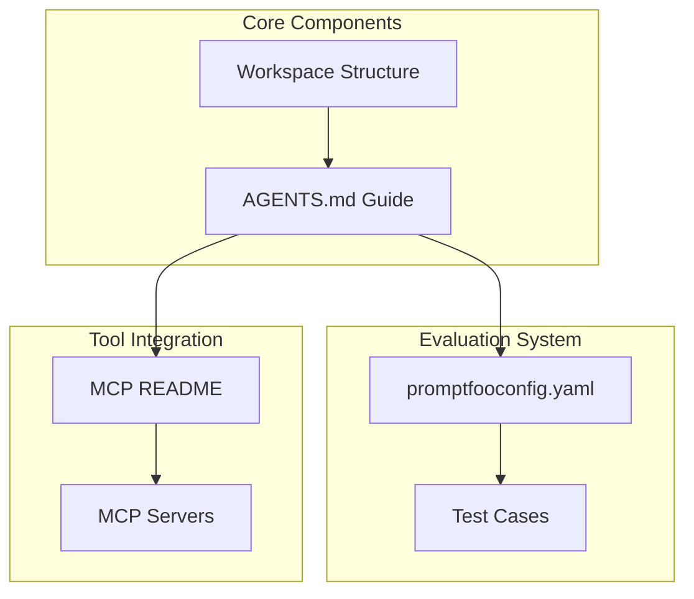
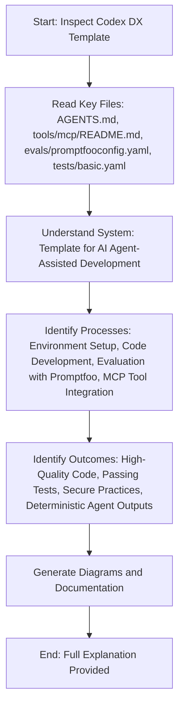

# Codex DX Template System Documentation

## Overview

The Codex DX Template is a comprehensive framework designed for AI agent-assisted software development. It provides a structured environment that supports both Node.js/TypeScript and Python projects, with built-in evaluation mechanisms to ensure high-quality, deterministic outputs from AI agents.

## Expected Outcomes

- **High-Quality Code**: Agents follow strict coding standards (ESLint/Prettier for TypeScript, Ruff/Black for Python) resulting in clean, maintainable code.
- **Passing Tests**: All unit tests pass locally, with lint/formatters passing without warnings.
- **Secure Practices**: No credentials, tokens, or personal data committed; offline/local sources preferred; minimal dependencies with lockfiles.
- **Deterministic Agent Outputs**: Evaluation via Promptfoo ensures agent responses are on-rail, containing relevant terms and minimal fixes.
- **Minimal Changes**: Only necessary files touched for fixes/features, with clear PR rationale.
- **Tool Integration**: Optional MCP (Model Context Protocol) servers provide specific tools for agents, enhancing capabilities without compromising security.

## System Architecture

### Core Components

- **AGENTS.md**: Concise guide for agents, outlining project overview, build/run instructions, code style, security boundaries, and definition of done.
- **Workspace Structure**: Organized folders for evals, tools, and project files.

### Evaluation System

- **promptfooconfig.yaml**: Configuration for Promptfoo, defining providers (e.g., OpenAI GPT-4.1-mini), prompts for code explanation/fixing, and assertions for output quality.
- **Test Cases**: YAML files with variables (e.g., file paths, test descriptions) and assertions to validate agent responses.

### Tool Integration

- **MCP README**: Documentation on integrating Model Context Protocol servers for granting specific tools to agents.
- **MCP Servers**: Configurable servers (e.g., context7 for documentation) added via CLI, kept minimal and read-only.

## Processes

### Development Workflow

1. **Environment Setup**: Install dependencies (pnpm for Node, pip for Python), create virtual environments.
2. **Code Development**: Follow code style guidelines, run dev servers, write tests.
3. **Evaluation**: Use Promptfoo to test agent prompts, ensuring outputs meet assertions (e.g., contain "AST" for code explanations).
4. **Tool Integration**: Optionally add MCP servers for additional capabilities like documentation access.
5. **Quality Gates**: Run tests, lints, and formatters; ensure minimal changes and secure commits.
6. **PR Submission**: Include root cause, patch rationale, and test evidence.

## Key Files Explanation

- **AGENTS.md**: Serves as the primary guide for AI agents, ensuring consistent development practices across projects using this template.
- **tools/mcp/README.md**: Explains how to configure MCP servers, emphasizing minimal access to maintain security.
- **evals/promptfooconfig.yaml**: Sets up evaluation framework with deterministic checks to keep agent outputs aligned.
- **tests/basic.yaml**: Example test case demonstrating how to structure evaluations for code fixes or explanations.

This template enables efficient, secure, and high-quality AI-assisted development by providing clear guidelines, evaluation mechanisms, and optional tool integrations.
